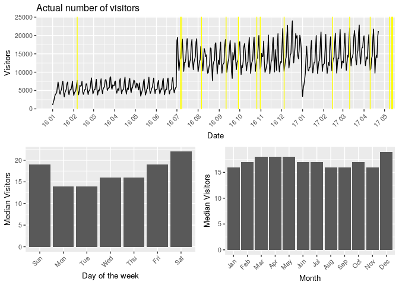
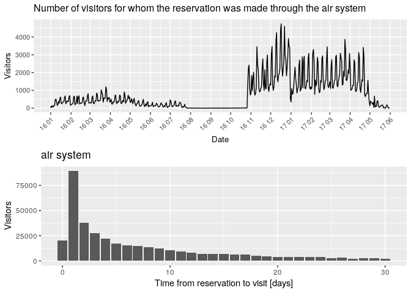
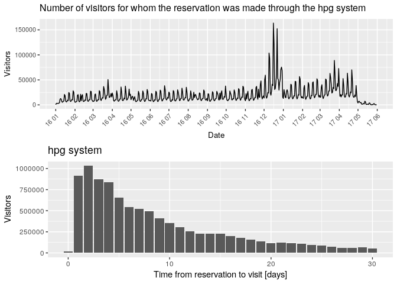
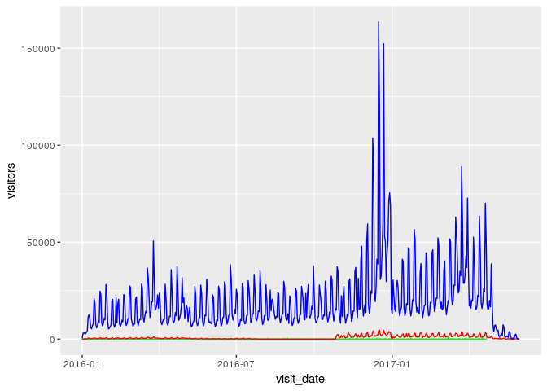

  
# 1. Introduction
  
The goal of this challenge is to predict the total number of visitors per restaurant per day. 
The data is collected from 2 Japanese websites: “Hot Pepper Gourmet" (hpg, similar to Yelp, search and reserve) and “AirREGI/Restaurant Board" (air, similar to Square, reservation control and cash register). 

The training data spans from Jan 2016 to most of Apr 2017, the test set includes the last week of Apr plus May 2017. The test data “intentionally spans a holiday week in Japan called the ‘Golden Week.’ 
  

# 2. Preparation

2.1. Libraries 


```r
# Data Manipulation
suppressMessages(library(dplyr))
suppressMessages(library(lubridate))

# Data Visualization
suppressMessages(library(ggplot2))
suppressMessages(library(gridExtra))
```
  
2.2. Load data


```r
air_stores <- read.csv(file = '../RecruitRestaurants/air_store_info.csv', header = TRUE)
air_res <- read.csv(file = '../RecruitRestaurants/air_reserve.csv', header = TRUE)
air_visits <- read.csv(file = '../RecruitRestaurants/air_visit_data.csv', header = TRUE)
hpg_stores <- read.csv(file = '../RecruitRestaurants/hpg_store_info.csv', header = TRUE)
hpg_res <- read.csv(file = '../RecruitRestaurants/hpg_reserve.csv', header = TRUE)
store_rel <- read.csv(file = '../RecruitRestaurants/store_id_relation.csv', header = TRUE)
calendar <- read.csv(file = '../RecruitRestaurants/date_info.csv', header = TRUE)

subm <- read.csv(file = '../RecruitRestaurants/sample_submission.csv', header = TRUE)
```

# 3. File structure and content


Data structure and summary

  
* **air_stores**


```
## Observations: 829
## Variables: 5
## $ air_store_id   <fctr> air_0f0cdeee6c9bf3d7, air_7cc17a324ae5c7dc, ai...
## $ air_genre_name <fctr> Italian/French, Italian/French, Italian/French...
## $ air_area_name  <fctr> Hyōgo-ken Kōbe-shi Kumoidōri, Hyōgo-ken Kōbe-s...
## $ latitude       <dbl> 34.69512, 34.69512, 34.69512, 34.69512, 35.6580...
## $ longitude      <dbl> 135.1979, 135.1979, 135.1979, 135.1979, 139.751...
```

```
##                air_store_id        air_genre_name
##  air_00a91d42b08b08d9:  1   Izakaya       :197   
##  air_0164b9927d20bcc3:  1   Cafe/Sweets   :181   
##  air_0241aa3964b7f861:  1   Dining bar    :108   
##  air_0328696196e46f18:  1   Italian/French:102   
##  air_034a3d5b40d5b1b1:  1   Bar/Cocktail  : 79   
##  air_036d4f1ee7285390:  1   Japanese food : 63   
##  (Other)             :823   (Other)       : 99   
##                         air_area_name    latitude       longitude    
##  Fukuoka-ken Fukuoka-shi Daimyō: 64   Min.   :33.21   Min.   :130.2  
##  Tōkyō-to Shibuya-ku Shibuya   : 58   1st Qu.:34.70   1st Qu.:135.3  
##  Tōkyō-to Minato-ku Shibakōen  : 51   Median :35.66   Median :139.7  
##  Tōkyō-to Shinjuku-ku Kabukichō: 39   Mean   :35.65   Mean   :137.4  
##  Tōkyō-to Setagaya-ku Setagaya : 30   3rd Qu.:35.69   3rd Qu.:139.8  
##  Tōkyō-to Chūō-ku Tsukiji      : 29   Max.   :44.02   Max.   :144.3  
##  (Other)                       :558
```

**air_stores** includes the type of the particular cuisine along with the name of the area and approximate location of 829 stores.

  
* **air_res**   

```
## Observations: 92,378
## Variables: 4
## $ air_store_id     <fctr> air_877f79706adbfb06, air_db4b38ebe7a7ceff, ...
## $ visit_datetime   <fctr> 2016-01-01 19:00:00, 2016-01-01 19:00:00, 20...
## $ reserve_datetime <fctr> 2016-01-01 16:00:00, 2016-01-01 19:00:00, 20...
## $ reserve_visitors <int> 1, 3, 6, 2, 5, 2, 4, 2, 2, 2, 3, 3, 2, 6, 7, ...
```

```
##                air_store_id               visit_datetime 
##  air_8093d0b565e9dbdf: 2263   2016-12-24 19:00:00:  255  
##  air_e55abd740f93ecc4: 1903   2016-12-29 18:00:00:  230  
##  air_0a74a5408a0b8642: 1831   2016-12-17 18:00:00:  229  
##  air_cf5ab75a0afb8af9: 1758   2016-12-24 18:00:00:  227  
##  air_6d65542aa43b598b: 1436   2017-02-04 19:00:00:  226  
##  air_de692863bb2dd758: 1355   2016-12-10 18:00:00:  219  
##  (Other)             :81832   (Other)            :90992  
##             reserve_datetime reserve_visitors 
##  2016-11-24 18:00:00:  106   Min.   :  1.000  
##  2016-12-24 17:00:00:  103   1st Qu.:  2.000  
##  2016-12-08 18:00:00:   95   Median :  3.000  
##  2016-12-06 19:00:00:   92   Mean   :  4.482  
##  2016-12-07 17:00:00:   91   3rd Qu.:  5.000  
##  2017-03-09 18:00:00:   90   Max.   :100.000  
##  (Other)            :91801
```

**air_res** contains date & time of the reservation, date & time of the visit and number of visitors for whom reservation was made.
  

```
## [1] 314
```
  
We have reservation & visit information for 314 stores from the air system.
  

* **air_visits**


```
## Observations: 252,108
## Variables: 3
## $ air_store_id <fctr> air_ba937bf13d40fb24, air_ba937bf13d40fb24, air_...
## $ visit_date   <fctr> 2016-01-13, 2016-01-14, 2016-01-15, 2016-01-16, ...
## $ visitors     <int> 25, 32, 29, 22, 6, 9, 31, 21, 18, 26, 21, 11, 24,...
```

```
##                air_store_id         visit_date        visitors     
##  air_5c817ef28f236bdf:   477   2017-03-17:   799   Min.   :  1.00  
##  air_36bcf77d3382d36e:   476   2017-03-03:   791   1st Qu.:  9.00  
##  air_a083834e7ffe187e:   476   2017-04-14:   791   Median : 17.00  
##  air_d97dabf7aae60da5:   476   2017-03-24:   789   Mean   : 20.97  
##  air_232dcee6f7c51d37:   475   2017-03-31:   786   3rd Qu.: 29.00  
##  air_60a7057184ec7ec7:   475   2017-04-21:   784   Max.   :877.00  
##  (Other)             :249253   (Other)   :247368
```
  
**air_visits** contains date of the visit as well as the total number of visitors for that date.
  

```
## [1] 829
```
  
We have information for 829 stores.


* **hpg_stores**


```
## Observations: 4,690
## Variables: 5
## $ hpg_store_id   <fctr> hpg_6622b62385aec8bf, hpg_e9e068dd49c5fa00, hp...
## $ hpg_genre_name <fctr> Japanese style, Japanese style, Japanese style...
## $ hpg_area_name  <fctr> Tōkyō-to Setagaya-ku Taishidō, Tōkyō-to Setaga...
## $ latitude       <dbl> 35.64367, 35.64367, 35.64367, 35.64367, 35.6436...
## $ longitude      <dbl> 139.6682, 139.6682, 139.6682, 139.6682, 139.668...
```

```
##                hpg_store_id                hpg_genre_name
##  hpg_001ce40a1f873e4f:   1   Japanese style       :1750  
##  hpg_001f8de5120ce935:   1   International cuisine: 700  
##  hpg_0034f74a25be3cbe:   1   Creation             : 410  
##  hpg_00394a75a35c427c:   1   Seafood              : 339  
##  hpg_004d556cb3f7995f:   1   Grilled meat         : 325  
##  hpg_0050eb4311ceeae4:   1   Italian              : 249  
##  (Other)             :4684   (Other)              : 917  
##                              hpg_area_name     latitude    
##  Tōkyō-to Shinjuku-ku None          : 257   Min.   :33.31  
##  Tōkyō-to Chūō-ku Ginza             : 198   1st Qu.:34.69  
##  Hyōgo-ken Kōbe-shi None            : 163   Median :35.66  
##  Ōsaka-fu Ōsaka-shi Shinsaibashisuji: 150   Mean   :35.81  
##  Osaka Prefecture Osaka None        : 145   3rd Qu.:35.70  
##  Hiroshima-ken Hiroshima-shi Hondōri: 135   Max.   :43.77  
##  (Other)                            :3642                  
##    longitude    
##  Min.   :130.3  
##  1st Qu.:135.5  
##  Median :139.5  
##  Mean   :137.7  
##  3rd Qu.:139.7  
##  Max.   :143.7  
## 
```

**hpg_stores** includes the type of the particular cuisine along with the name of the area and approximate location of 4 690 stores.


* **hpg_res**


```
## Observations: 2,000,320
## Variables: 4
## $ hpg_store_id     <fctr> hpg_c63f6f42e088e50f, hpg_dac72789163a3f47, ...
## $ visit_datetime   <fctr> 2016-01-01 11:00:00, 2016-01-01 13:00:00, 20...
## $ reserve_datetime <fctr> 2016-01-01 09:00:00, 2016-01-01 06:00:00, 20...
## $ reserve_visitors <int> 1, 3, 2, 5, 13, 2, 2, 2, 2, 6, 2, 2, 2, 2, 5,...
```

```
##                hpg_store_id                 visit_datetime   
##  hpg_2afd5b187409eeb4:   1155   2016-12-16 19:00:00:  10528  
##  hpg_011e799ba201ad2e:    822   2016-12-22 19:00:00:  10475  
##  hpg_9b20c78a9b8179d9:    778   2016-12-17 19:00:00:   7524  
##  hpg_527c60506b80ac72:    740   2016-12-09 19:00:00:   7103  
##  hpg_3f9e56ac6f9435c7:    729   2016-12-24 19:00:00:   6884  
##  hpg_4ca09101fa3a220c:    712   2016-12-17 18:00:00:   6707  
##  (Other)             :1995384   (Other)            :1951099  
##             reserve_datetime   reserve_visitors 
##  2016-12-12 21:00:00:    907   Min.   :  1.000  
##  2016-12-13 21:00:00:    889   1st Qu.:  2.000  
##  2016-12-14 21:00:00:    865   Median :  3.000  
##  2016-12-07 21:00:00:    853   Mean   :  5.074  
##  2016-12-06 21:00:00:    840   3rd Qu.:  6.000  
##  2016-12-05 21:00:00:    837   Max.   :100.000  
##  (Other)            :1995129
```
  
**hpg_res** contains date & time of the reservation, date & time of the visit and number of visitors for whom reservation was made.
  

```
## [1] 13325
```
  
We have reservation & visit information for 13 325 stores from the hpg system.  
  

* **store_rel**


```
## Observations: 150
## Variables: 2
## $ air_store_id <fctr> air_63b13c56b7201bd9, air_a24bf50c3e90d583, air_...
## $ hpg_store_id <fctr> hpg_4bc649e72e2a239a, hpg_c34b496d0305a809, hpg_...
```
  
**store_rel** connects the air and hpg id's. There are only 150 pairs, which is less than 20% of all air stores.  

* **calendar**


```
## Observations: 517
## Variables: 3
## $ calendar_date <fctr> 2016-01-01, 2016-01-02, 2016-01-03, 2016-01-04,...
## $ day_of_week   <fctr> Friday, Saturday, Sunday, Monday, Tuesday, Wedn...
## $ holiday_flg   <int> 1, 1, 1, 0, 0, 0, 0, 0, 0, 0, 1, 0, 0, 0, 0, 0, ...
```

**calendar** gives basic information about the calendar dates in the dataset, flags holidays.

# 4. Data Manipulation

Reformat some features


```r
air_visits <- air_visits %>% mutate(visit_date = ymd(visit_date))
air_res <- air_res %>% mutate(visit_datetime = ymd_hms(visit_datetime),
                              reserve_datetime = ymd_hms(reserve_datetime),
                              visit_date = date(visit_datetime),
                              diff_day = ceiling(time_length(visit_datetime - reserve_datetime, unit = "day")))
hpg_res <- hpg_res %>% mutate(visit_datetime = ymd_hms(visit_datetime),
                              reserve_datetime = ymd_hms(reserve_datetime),
                              visit_date = date(visit_datetime),
                              diff_day = ceiling(time_length(visit_datetime - reserve_datetime, unit = "day")))
calendar <- calendar %>% mutate(calendar_date = ymd(calendar_date),
                        holiday_flg = as.logical(holiday_flg))
```

# 5. Data Visualization

5.1. Air Visits

Number of visits to the air restaurant


```r
air_visits <- left_join(air_visits, calendar, by=c("visit_date"="calendar_date"))

p1_vis <- air_visits %>% 
            group_by(visit_date) %>%
            summarise(total_no_visitors = sum(visitors)) %>%
            ggplot(aes(x = visit_date, y = total_no_visitors)) +
                geom_line() + 
                scale_x_date(date_breaks = "1 month", date_labels = '%y %m') +
                theme(text = element_text(size = 10), axis.text.x = element_text(angle = 45, hjust = 1)) + 
                labs(x = "Date", y = "Visitors", title = 'Actual number of visitors') +
                geom_vline(xintercept = air_visits$visit_date[1] + which(air_visits$holiday_flg == 1), col = 'yellow')


p1_vis_p_day <- air_visits %>% 
                    mutate(wday = wday(visit_date, label = TRUE)) %>%
                    group_by(wday) %>%
                    summarise(median_visitors = median(visitors)) %>%
                    ggplot(aes(x = wday, y = median_visitors)) +
                    geom_col() + 
                    theme(text = element_text(size = 10), axis.text.x = element_text(angle = 45, hjust = 1)) + 
                    labs(x = "Day of the week", y = "Median Visitors")

p1_vis_p_month <- air_visits %>% 
                    mutate(month = month(visit_date, label = TRUE)) %>%
                    group_by(month) %>%
                    summarise(median_visitors = median(visitors)) %>%
                    ggplot(aes(x = month, y = median_visitors)) +
                    geom_col() + 
                    theme(text = element_text(size = 10), axis.text.x = element_text(angle = 45, hjust = 1)) + 
                    labs(x = "Month", y = "Median Visitors")

lay = rbind(c(1,1), c(2,3))
grid.arrange(p1_vis, p1_vis_p_day, p1_vis_p_month, layout_matrix = lay)
```

<!-- -->


We find:

* Periodic pattern, corresponds to weekly cycles
* Actual number of visitors suddenly shoot up in July 2016 (new restaurants added to the system?). Sudden drop of the visits on New Year's eve.
* Friday and the weekend appear to be the most popular days, Monday and Tuesday have the lowest number of visitors
* December appears to be the most popular month. The period March - May is also relatively busy
* No significant impact of holidays

5.2. Reservations


```r
p2_air_res <- air_res %>% 
            group_by(visit_date = date(visit_datetime)) %>%
            summarise(total_no_visitors = sum(reserve_visitors)) %>%
            ggplot(aes(x = visit_date, y = total_no_visitors)) +
                geom_line() + 
                scale_x_date(date_breaks = "1 month", date_labels = '%y %m') +
                theme(text = element_text(size = 10), axis.text.x = element_text(angle = 45, hjust = 1)) +
                labs(x = 'Date', y = 'Visitors', title = 'Number of visitors for whom the reservation was made through the air system')

air_res_diff_time <- air_res %>% 
            group_by(diff_day) %>%
            summarise(total_no_visitors = sum(reserve_visitors))

p2_air_diff_time <- air_res_diff_time  %>%
            filter(diff_day <= 30) %>%
            ggplot(aes(x = diff_day, y = total_no_visitors)) +
            geom_col() +
            labs(x = 'Time from reservation to visit [days]', y = 'Visitors', title = 'air system')
grid.arrange(p2_air_res, p2_air_diff_time, nrow=2)
```

<!-- -->


```r
p3_hpg_res <- hpg_res %>% 
            group_by(visit_date = date(visit_datetime)) %>%
            summarise(total_no_visitors = sum(reserve_visitors)) %>%
            ggplot(aes(x = visit_date, y = total_no_visitors)) +
                geom_line() + 
                scale_x_date(date_breaks = "1 month", date_labels = '%y %m') +
                theme(text = element_text(size = 10), axis.text.x = element_text(angle = 45, hjust = 1)) +
                labs(x = 'Date', y = 'Visitors', title = 'Number of visitors for whom the reservation was made through the hpg system')

hpg_res_diff_time <- hpg_res %>% 
            group_by(diff_day) %>%
            summarise(total_no_visitors = sum(reserve_visitors))

p3_hpg_diff_time <- hpg_res_diff_time  %>%
            filter(diff_day <= 30) %>%
            ggplot(aes(x = diff_day, y = total_no_visitors)) +
            geom_col() +
            labs(x = 'Time from reservation to visit [days]', y = 'Visitors', title = 'hpg system')

grid.arrange(p3_hpg_res, p3_hpg_diff_time, nrow=2)
```

<!-- -->


```r
air_by_date <- air_res %>% group_by(visit_date) %>% summarise(no_res = sum(reserve_visitors))
hpg_by_date <- hpg_res %>% group_by(visit_date) %>% summarise(no_res = sum(reserve_visitors))

p4_res_vs_vis <- ggplot() + 
                    geom_line(data = air_visits, aes(x = visit_date, y = visitors), color = 'green') +
                    geom_line(data = air_by_date, aes(x = visit_date, y = no_res), color = 'red') + 
                    geom_line(data = hpg_by_date, aes(x = visit_date, y = no_res), color = 'blue')
 
 plot(p4_res_vs_vis)
```

<!-- -->
We find:

* Reservations made through the hpg system are many more than through air system. Air system seems to be dead between end of July and end of October 2016
* Reservations through both systems are typically made up to 4 days in advance. Note that there is a large number of reservation for the same day made through the air system, not the case for the hpg system
* For both systems the number of reservations drops towards the end of the training period
* Number of visitors for whom reservation was made is much greater than the actual number of visitors

Since most of the reservations are made only a couple of days before the visit and we have no such information for the test set I'm not planning to use it.


5.3. Location


```r
# Extract prefecture from area_name
air_stores$pref <- gsub( " .*$", "", air_stores$air_area_name)
```
